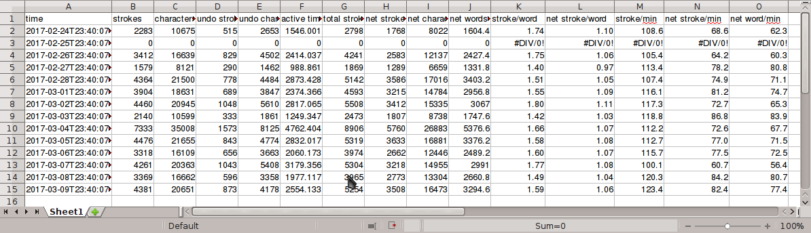

# Steno stats

Scripts for analyzing Plover logs and dictionaries and giving various information.


## strokes_per_word.py

Requires Plover source in the PYTHONPATH environment variable (prefix the command with PYTHONPATH=/path/to/plover).

**usage**: strokes_per_word.py [-h] [-r RESUME] [-s SUSPEND] logs [logs ...]

Calculate strokes per word in plover logs. Outputs to standard out.

**positional arguments**:
* *logs*                log file paths

**optional arguments**:
* *-h, --help*          show this help message and exit
* *-r RESUME, --resume RESUME*
                        start recording after encountering this translation
* *-s SUSPEND, --suspend SUSPEND*
                        stop recording when encountering this translation

**example**:

```PYTHONPATH=~/projects/plover python strokes_per_word.py -r {PLOVER:RESUME} -s {PLOVER:SUSPEND} ~/.local/share/plover/strokes.log```

```
1.62321789416 stroke/word  (58352/42954.8)
1.0936845242 net stroke/word  (46979/42954.8)
```

## translation_count.py

Requires Plover source in the PYTHONPATH environment variable (prefix the command with PYTHONPATH=/path/to/plover).

**usage**: translation_count.py [-h] [-r RESUME] [-s SUSPEND] logs [logs ...]

Count entry counts in plover logs. Outputs a JSON formatted dictionary of translations and dictionaries of stroke sequences and their counts to standard out.

**positional arguments**:
* *logs*                log file paths

**optional arguments**:
* *-h, --help*          show this help message and exit
* *-r RESUME, --resume RESUME*
                        start recording after encountering this translation
* *-s SUSPEND, --suspend SUSPEND*
                        stop recording when encountering this translation

**example**:

```PYTHONPATH=~/projects/plover python translation_count.py -r {PLOVER:RESUME} -s {PLOVER:SUSPEND} ~/.local/share/plover/strokes.log > examples/translation_count.json```

```
{
  "{,}": {
    "KW-BG": 2706,
    "W-BG": 8,
    "TP-PL/KW-BG": 4,
    "KW-B": 4,
    "KWR-BG": 4,
    "TP-BG": 2,
    "KWABG": 1,
    "-RBGS": 1,
    "-BGS": 1,
    "KWR-BGS": 1,
    "-RB": 1
  },
  "{.}": {
    "TP-PL": 2416,
    "T-PL": 20,
    "TPH-PL": 17,
    "-P": 7,
    "-PL": 6,
```
[full output](examples/translation_count.json)

## time_statistics.py

Requires Plover source in the PYTHONPATH environment variable (prefix the command with PYTHONPATH=/path/to/plover).

**usage**: time_statistics.py [-h] [-r RESUME] [-s SUSPEND]
                        [-sa SPEED_ACTIVATION SPEED_ACTIVATION SPEED_ACTIVATION]
                        -w SAMPLE_WINDOW [--raw]
                        logs [logs ...]

Measure statistics over time in Plover logs. Outputs as CSV to standard out.

**positional arguments**:
* *logs*                log file paths

**optional arguments**:
* *-h, --help*          show this help message and exit
* *-r RESUME, --resume RESUME*
                        start recording after encountering this translation
* *-s SUSPEND, --suspend SUSPEND*
                        stop recording when encountering this translation
* *-sa SPEED_ACTIVATION SPEED_ACTIVATION SPEED_ACTIVATION, --speed_activation SPEED_ACTIVATION SPEED_ACTIVATION SPEED_ACTIVATION*
                        speed to start recording on (stroke/second), speed to
                        stop recording on (stroke/second), length of window to
                        check speed in (seconds)
* *-w SAMPLE_WINDOW, --sample-window SAMPLE_WINDOW*
                        duration of time (seconds) to sample for each discrete
                        statistic
* *--raw*               raw statistics only, no derived

**example**:

```PYTHONPATH=~/projects/plover python time_statistics.py -r {PLOVER:RESUME} -s {PLOVER:SUSPEND} -sa 1 0.5 4 -w 86400 ~/.local/share/plover/strokes.log > examples/time_statistics.csv```


[full output](examples/time_statistics.csv)

## stroke_ngrams.py

Requires Plover source in the PYTHONPATH environment variable (prefix the command with PYTHONPATH=/path/to/plover).

**usage**: stroke_ngrams.py [-h] [-r RESUME] [-s SUSPEND] -n RANGE RANGE
                        [-c MIN_COUNT] [-l LIMIT_OUTPUT]
                        logs [logs ...]

Count stroke n-grams in plover logs. Outputs a JSON formatted dictionary of stroke sequences and their counts to standard out.

**positional arguments**:
* *logs*                log file paths

**optional arguments**:
* *-h, --help*          show this help message and exit
* *-r RESUME, --resume RESUME*
                        start recording after encountering this translation
* *-s SUSPEND, --suspend SUSPEND*
                        stop recording when encountering this translation
* *-n RANGE RANGE, --range RANGE RANGE*
                        range of stroke n-grams to track
* *-c MIN_COUNT, --min-count MIN_COUNT*
                        minimum count to output
* *-l LIMIT_OUTPUT, --limit-output LIMIT_OUTPUT*
                        maximum output entries

**example**:

```PYTHONPATH=~/projects/plover python stroke_ngrams.py -r {PLOVER:RESUME} -s {PLOVER:SUSPEND} -n 2 4 -l 100 ~/.local/share/plover/strokes.log > examples/stroke_ngrams.json```

```
{
  "KW-BG/SKP": 244,
  "TP-PL/EU": 146,
  "TP-PL/KPA*": 125,
  "KW-BG/PWUT": 120,
  "TP-PL/-T": 114,
  "KW-BG/-T": 104,
  "EPLT/TP-PL": 86,
  "TEL/PHE": 84,
  "KW-BG/EU": 82,
  "TP-PL/SKP": 82,
  "S-PBT/KWRUR": 81,
  "TKOEPBT/TEL": 81,
  "TPHAUPB/EPLT": 80,
  "TKOEPBT/TEL/PHE": 80,
  "TP-PL/T": 76,
  "-B/S-G": 70,
  "KW-BG/T": 62,
  "R-R/R-R": 62,
  "TP-PL/T-S": 62,
```
[full output](examples/stroke_ngrams.json)

## translation_boundary_errors.py

**usage**: translation_boundary_errors.py [-h] [-ht] [-ss STROKE_SEQUENCE] [-at]
                                      [-p]
                                      dictionaries [dictionaries ...]

Find potential translation boundary errors in dictionaries. Outputs a JSON
formatted dictionary of stroke sequences and a list of their potential
translation boundary errors to standard out.

**positional arguments**:
* *dictionaries*        dictionary file paths

**optional arguments**:
* *-h, --help*          show this help message and exit
* *-t, --trivial*       include trivial matches, these are matches where the
                        strokes match exactly (eg/ A/HED and A HED)
* *-ss STROKE_SEQUENCE, --stroke_sequence STROKE_SEQUENCE*
                        only look for boundary errors involving this stroke
                        sequence
* *-at, --add_translations*
                        add translations to stroke lists
* *-p, --progress*      output progress percentage on standard error

**example**:

```python translation_boundary_errors.py -ss ALG/REUFPL -at ~/.local/share/plover/main.json```

```
{
  "PWRABG/KWREU/SEF/ALG: brachycephalic": {
    "PWRABG KWREU SEF ALG/: <{^} {^y} {self-^} ALG/": 19,
    "PWRABG/KWREU SEF ALG/: {brachy^} {self-^} ALG/": 19
  },
  "PHET/ALG: metallic": {
    "PHET ALG/: met ALG/": 19
  },
  "APB/ALG: an additional": {
    "APB ALG/: an ALG/": 19
  },
  "TOET/ALG: totaling": {
    "TOET ALG/: tote ALG/": 19
  },
  "ALG/REUFPL: algorithm": {
    "ALG REUFPL/: additional REUFPL/": 2
  }
}
```

